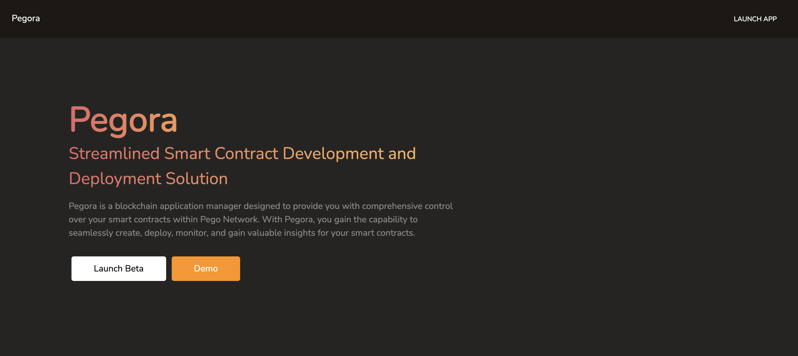
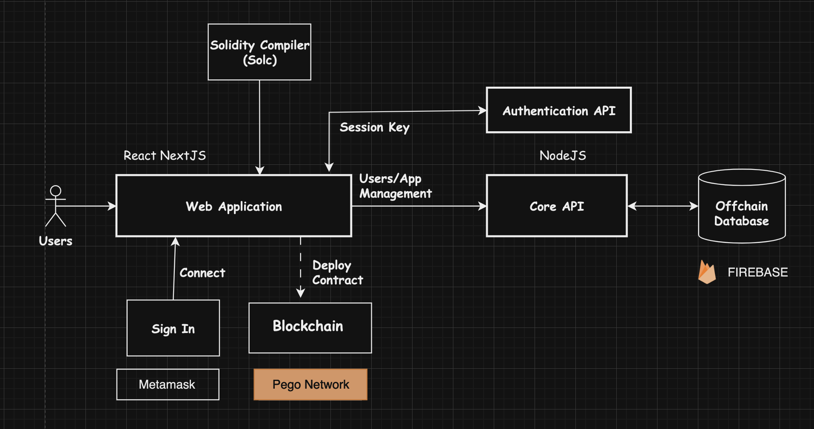
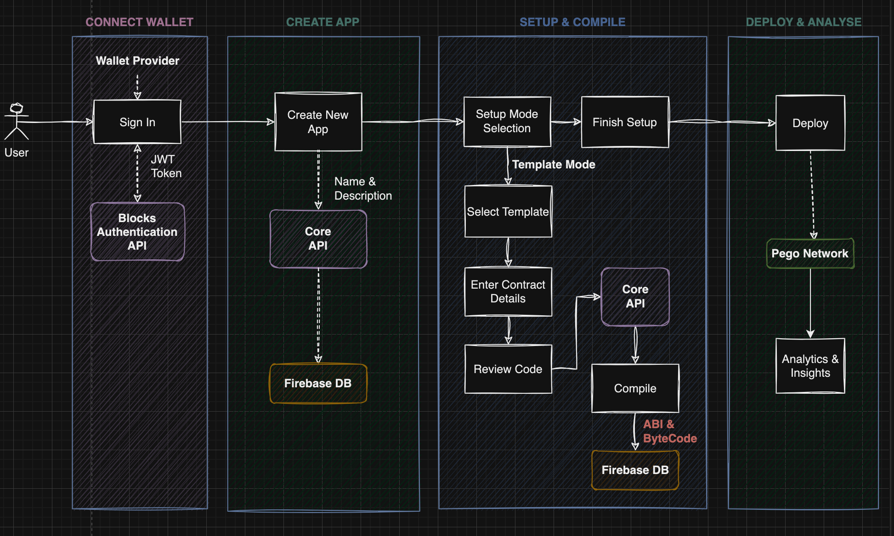

## Zhelp
Zhelp is a smart contract deployer and manager tool for zetachain, Equipped with no-code templates,
seamless wallet integrations, and robust analytical tools, 
it offers a user-friendly solution for creating, deploying, and overseeing smart contracts.

### website
https://zhelp.vercel.app/

    

### Description
Project Objective: Our goal is to empower and help individuals with the ability to easily create, deploy, manage, and gain valuable insights from their smart contracts

### Source of Inspiration:

In our quest for innovation, we posed a fundamental question: "How can we truly democratize the incredible capabilities of Zetachain, ensuring that everyone, regardless of their technical background, can harness its immense benefits?"

Our inspiration for Zhelp ignited from the profound realization of Zetachain's boundless potential. It's a platform that promises to solves the problems of “cross-chain” and “multi-chain” and to supports a truly fluid, multi-chain crypto ecosystem. Yet, this potential remains locked behind the intricate complexities of developing and managing decentralized applications (dApps).

Our mission was clear: create a solution for both seasoned developers and visionary non-technical individuals, bridging the gap between innovative ideas and functional dApps, and unlocking the full potential of Zetachain.

Zhelp is our answer to this challenge—an ingenious solution that empower everyone to effortlessly create, deploy, manage, and gain insights from their smart contracts. It bridges technical gap, making Zetachain accessible to all. With Zhelp, you can seamlessly transition from idea to functional dApp, harnessing the transformative power of Zetachain to shape a decentralized future for everyone.

### About the Initiative
A Simplified Approach to Smart Contract Management.
Zhelp is an intuitive blockchain application manager tailored for Zetachain. It streamlines the process of creating, deploying, managing, and analyzing smart contracts, catering to both novices and seasoned blockchain engineers.

Equipped with no-code templates, seamless wallet integrations, and robust analytical tools, Blocks levels the playing field for both beginners and advanced users, ensuring that blockchain technology becomes accessible to all and heralding a more decentralized digital era.

### Noteworthy Features

- No Code Contract Builder

Craft your contracts using an ever-expanding library of pre-set contract templates that can be customized without any coding expertise.

- App Manager

Establish multiple apps, each equipped with its dedicated smart contract, offering you a comprehensive overview of your dApps.

- Built-in Contract Compiler

Compile your smart contracts directly within the platform.

- Built-in Contract Deployer

Deploy your contracts on the ZetaChain mainnet (soon when it's live) and testnet with a simple click.

**Coming Soon**
- For advanced users: Build contracts with custom code.
- Import existing contracts that has been deployed.
- Link multiple wallets
- App version management
- Contract Analytics and Insights

### Business Model

    

While we strive to keep the majority of features free so anyone can experience and use BlockFabric, we plan to introduce a freemium model in the future to sustain the project's development. The platform will still remain free for basic use, and allows unlimited restrictions for paid users.

**Community Contributed Templates**: We are also considering to open up our templates collection so other developers can build and share their templates and possibly earn commission from their use.

    

#### Web Application & APIs

- The frontend Web Application is developed in **React** using the **NextJS** framework. The authentication and core APIs are developed in NodeJS.
- These applications are hosted on [Vercel](https://www.vercel.com).

#### Compiler
- [Solidity Compiler (Solc)](https://www.npmjs.com/package/solc) is used for compiling Solidity code into Contract Application Binary Image (ABI) and byte code.

#### Contract Interactions/Deployments
- [Web3.js](https://github.com/web3/web3.js) is the library we use for all contract interactions, including deployments.

#### Offchain Database

- The offchain database is used to store the encrypted messages and various operations of the application. 
- The database is hosted on [Google Firebase](https://firebase.google.com) using the Firestore service.

### Process Flow

    

#### Connect Wallet & Handshaking
- Users first connect to XDC Blockchain using a wallet provider like XDCPay. After connecting, user then signs a message to the Authentication API, which verifies the signed message and returns a generated JWT token for access to the Core API.

#### Creating an App
- Users would create their first app after accessing the platform. An app is a container that will hold and manage the smart contract. Users can create multiple apps.

#### Contract Details & Compilation
- Setting up an app is quick easy with only a few steps: selecting mode (build from template, custom code, or existing contract import).
- In Build from Template, the steps would require selecting a template, entering contract details, review generated code and compile.

#### Publishing
- Once a contract is compiled within an app, it can be deployed with just a click. Apps deployed can then collect tranasction data from the blockchain for insights and analytics.

## Project Roadmap

**Q3 2023**
- Project inception, planning and prototyping
- MVP product engineering and development
- Beta launch on mainnet

**Q1 & Q2 2024**
- Feature implementation and refinements
    - Version management, wallet management, analytics and insights
    - Contract import and custom code
    - More preset templates
- Public outreach and marketing
- Launch of complete and stable version on mainnet
